# Quiz 1: Comprueba tus destrezas analiticas

### Q1. Identifica el patrón de izquierda a derecha en el conjunto de bloques a continuación e intenta predecir qué bloque debe ir en el lugar del bloque con el signo de interrogación.

&nbsp;

<!--- 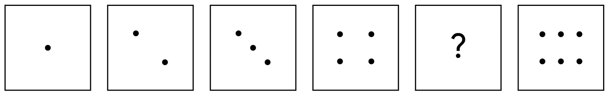 -->

**Bloque faltante:**

<!--- 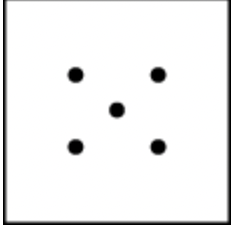 -->

> Este es el bloque que falta. El patrón de los puntos aumenta en uno en cada bloque. Por lo tanto, la mejor respuesta tiene cinco puntos.

&nbsp;

### Q2. Aquí hay un patrón más complejo. Identifica el patrón de izquierda a derecha en las imágenes a continuación e intenta predecir qué imagen debe venir a continuación.

&nbsp;

<!--- 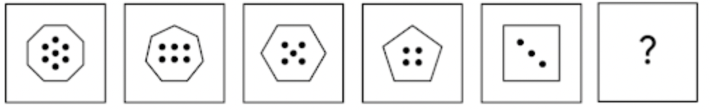 -->

**Bloque faltante:**

<!--- 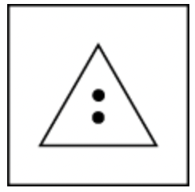 -->

> Esta es la siguiente imagen de la secuencia basada en dos patrones presentes en la serie: el número de lados y el número de puntos. Yendo de izquierda a derecha, ambos disminuyen en uno. Según estos patrones, si el bloque anterior contenía una forma con cuatro lados y tres puntos, entonces la siguiente forma debería tener tres lados y dos puntos.

&nbsp;

### Q3. Ahora debes buscar un patrón en un formato diferente. Selecciona el siguiente número de la secuencia:

Completa el espacio en blanco: 9, 13, 17, 21, 25, 29, _____

- 55
- **33**
- 10
- 25

> La respuesta correcta es 33. El patrón de números está aumentando, y la diferencia entre cada número es 4.

&nbsp;

### Q4. Los siguientes números están en una secuencia de izquierda a derecha. Define el patrón y decide qué número debe venir a continuación:
 
Completa el espacio en blanco: 4, 9, 16, 25, 36, 49, _____

- 30
- **64**
- 81
- 62

> El siguiente número de la serie es el 64. Hay dos patrones en la secuencia. Una es que cada número es el cuadrado de otro número y, luego, al número que se cuadra se le suma uno (por ejemplo, 2², 3², 4², 5², 6², 7²). El segundo patrón está en la diferencia entre los números de la secuencia: 9 - 4 = 5, 16 - 9 = 7, 25 - 16 = 9, y así sucesivamente.

&nbsp;

### Q5. La siguiente pregunta es sobre reconocer y hacer coincidir patrones en formas que son iguales, pero vistas desde diferentes ángulos.
 
Dos formas son similares cuando una puede convertirse en la otra después de rotarla en el sentido de las agujas del reloj ⟳ o en sentido contrario a las agujas del reloj ↺, o ser un reflejo horizontal ↔ y/o vertical ↕.

&nbsp;

<!--- 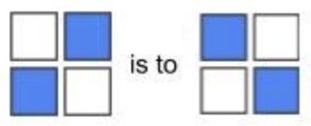 -->

&nbsp;

Tu tarea es elegir la figura que completa la instrucción. Presta atención al patrón que siguen la primera y la segunda forma y luego define qué opción coincide con la forma 3. Completa el espacio en blanco:

&nbsp;

<!--- 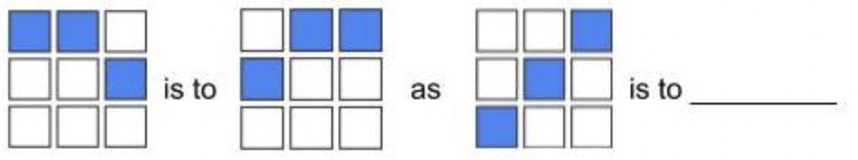 -->

&nbsp;

**Bloque faltante:**

<!--- 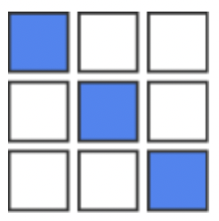 -->

> Esta imagen completa la instrucción. La primera imagen de la instrucción se refleja en la segunda imagen. Para completar la analogía, la respuesta sería una imagen que es un reflejo lado a lado de la tercera imagen.

&nbsp;

### Q6. La siguiente pregunta es sobre reconocer y hacer coincidir patrones en formas que son iguales, pero vistas desde diferentes ángulos. Dos formas son similares cuando una puede convertirse en la otra después de rotarla en el sentido de las agujas del reloj ⟳ o en sentido contrario a las agujas del reloj ↺, o ser un reflejo horizontal ↔ y/o vertical ↕.

&nbsp;

Tu tarea es elegir la figura que completa la instrucción. Completa el espacio en blanco:

&nbsp;

<!--- 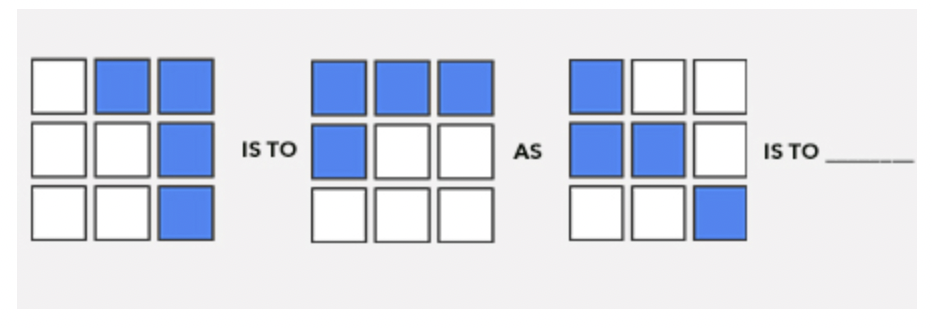 -->

&nbsp;

**Bloque faltante:**

<!--- 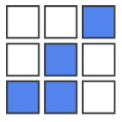 -->

&nbsp;

### Q7. La siguiente serie de códigos está en una secuencia de izquierda a derecha. Notarás que hay un patrón repetitivo. Define el patrón y decide qué código debe venir a continuación:
 
Completa el espacio en blanco: A1, B3, C5, D7, E9, F11, G13, _____

- J15
- H16
- D17
- **H15**

> Los patrones de esta serie son las letras ordenadas alfabéticamente y los números que aumentan en dos con cada nuevo conjunto. Por lo tanto, siguiendo ese patrón, el siguiente código sería H15.

&nbsp;

### Q8. La siguiente serie de códigos está en una secuencia de izquierda a derecha. Notarás que hay un patrón repetitivo. Define el patrón y decide qué secuencia de letras debe venir a continuación:

Completa el espacio en blanco: A, AA, AAA, B, BA, BAA, BAAA, BB, BBA, BBAA, BBAAA, BBB, ________

- BBAA
- BBAAA
- BBBB
- **BBBA**

> El patrón en esta secuencia sigue la letra A. A se agrega hasta que hay tres aes, que es cuando la letra B toma el lugar de las aes anteriores, y el patrón continúa. Por lo tanto, BBBA es la siguiente en la serie.

&nbsp;

### Q9. Ahora, identifica patrones en un problema de palabras utilizando una visualización de datos. Hay 12 chocolates en una caja: ocho tienen relleno de caramelo, seis tienen relleno de coco y dos tienen relleno de caramelo y coco. Elige la imagen que se ajusta mejor a la descripción de esta caja de bombones.

&nbsp;

**Respuesta:**

<!--- 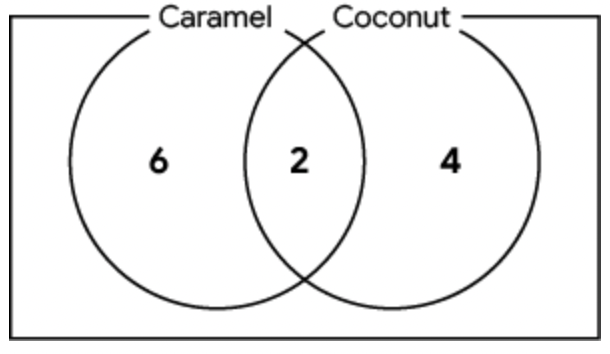 -->

> Este diagrama representa solamente seis chocolates con relleno de caramelo, cuatro chocolates con relleno de coco y dos chocolates con relleno de caramelo y coco; el número total de chocolates es 12.

&nbsp;

### Q10. Hay 10 niños en una clase y todos han traído sánduches para el almuerzo: cinco niños tienen sánduches de mantequilla de maní, seis niños tienen sánduches de mermelada y tres niños tienen sánduches de mantequilla de maní y mermelada.

&nbsp;

Calcula cuántos niños tienen sánduches sin mantequilla de maní ni mermelada y elige la imagen que mejor describa la situación.

&nbsp;

<!--- 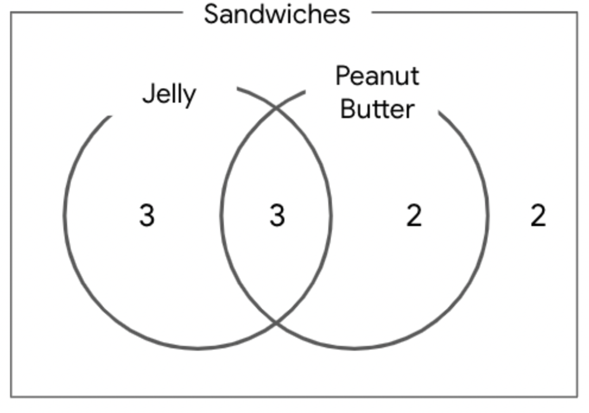 -->

&nbsp;

> En este diagrama, hay seis sánduches de mermelada, cinco sánduches de mantequilla de maní y tres sánduches de ambos. Esto significa que hay (5 + 6 - 3 = 8) ocho sánduches de mantequilla de maní o mermelada. Hay un total de 10 niños. Piensa en lo siguiente: 10 - 8 = 2. Esto significa que los sánduches de dos niños no tienen ni mantequilla de maní ni mermelada.