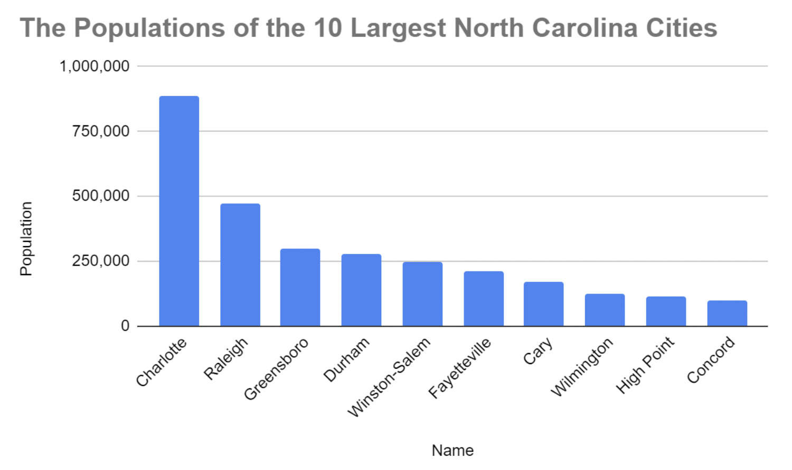

# Desafio semanal: Semana 4

### Q1. En la fila 1 de la siguiente hoja de cálculo, ¿cómo se denominan las palabras rango, nombre, población y condado? 

&nbsp;

|    | A                 | B             | C             | D                                     |
|----|-------------------|---------------|---------------|---------------------------------------|
| 1  | **Clasificación** | **Nombre**    | **Población** | **Condado**                           |
| 2  | 1                 | Charlotte     | 885,708       | Mecklenburg                           |
| 3  | 2                 | Raleigh       | 474,069       | Wake (capital), Durham                |
| 4  | 3                 | Greensboro    | 296,710       | Guilford                              |
| 5  | 4                 | Durham        | 278,993       | Durham (capital), Wake, Orange        |
| 6  | 5                 | Winston-Salem | 247,945       | Forsyth                               |
| 7  | 6                 | Fayetteville  | 211,657       | Cumberland                            |
| 8  | 7                 | Cary          | 170,282       | Wake, Chatham                         |
| 9  | 8                 | Wilmington    | 123,784       | New Hanover                           |
| 10 | 9                 | High Point    | 112,791       | Guilford, Randolph, Davidson, Forsyth |
| 11 | 10                | Concord       | 96,341        | Cabarrus                              |

&nbsp;

- **Atributos**
- Características
- Descriptores 
- Criterios 

> Estas palabras son atributos, que hacen referencia a la información de las columnas siguientes. En una tabla, un atributo es una característica o cualidad de los datos utilizados para etiquetar una columna.

&nbsp;

### Q2. En la siguiente hoja de cálculo, ¿dónde puedes encontrar todos los atributos —también conocidos como observación— de Fayetteville?

&nbsp;

|    | A                 | B             | C             | D                                     |
|----|-------------------|---------------|---------------|---------------------------------------|
| 1  | **Clasificación** | **Nombre**    | **Población** | **Condado**                           |
| 2  | 1                 | Charlotte     | 885,708       | Mecklenburg                           |
| 3  | 2                 | Raleigh       | 474,069       | Wake (capital), Durham                |
| 4  | 3                 | Greensboro    | 296,710       | Guilford                              |
| 5  | 4                 | Durham        | 278,993       | Durham (capital), Wake, Orange        |
| 6  | 5                 | Winston-Salem | 247,945       | Forsyth                               |
| 7  | 6                 | Fayetteville  | 211,657       | Cumberland                            |
| 8  | 7                 | Cary          | 170,282       | Wake, Chatham                         |
| 9  | 8                 | Wilmington    | 123,784       | New Hanover                           |
| 10 | 9                 | High Point    | 112,791       | Guilford, Randolph, Davidson, Forsyth |
| 11 | 10                | Concord       | 96,341        | Cabarrus                              |

&nbsp;

- **Fila 7**
- Celda B7
- Fila 6
- Columna B

> La observación de Fayetteville está en la fila 7. Una observación son todos los atributos de algo contenido en una fila de una tabla de datos. 

&nbsp;

### Q3. Completa el espacio en blanco: En la siguiente hoja de cálculo, la función _____ se utilizó para ordenar alfabéticamente los nombres de las ciudades de la columna B.

&nbsp;

|    | A                 | B             | C             | D                                     |
|----|-------------------|---------------|---------------|---------------------------------------|
| 1  | **Clasificación** | **Nombre**    | **Población** | **Condado**                           |
| 2  | 7                 | Cary          | 170,282       | Wake, Chatham                         |
| 3  | 1                 | Charlotte     | 885,708       | Mecklenburg                           |
| 4  | 10                | Concord       | 96,341        | Cabarrus                              |
| 5  | 4                 | Durham        | 278,993       | Durham (capital), Wake, Orange        |
| 6  | 6                 | Fayetteville  | 211,657       | Cumberland                            |
| 7  | 3                 | Greensboro    | 296,710       | Guilford                              |
| 8  | 9                 | High Point    | 112,791       | Guilford, Randolph, Davidson, Forsyth |
| 9  | 2                 | Raleigh       | 474,069       | Wake (capital), Durham                |
| 10 | 8                 | Wilmington    | 123,784       | New Hanover                           |
| 11 | 5                 | Winston-Salem | 247,945       | Forsyth                               |

&nbsp;

- **rango de clasificación** 
- rango de organización
- rango de nombres
- rango aleatorio 

> Se utilizó el rango de clasificación para ordenar alfabéticamente los nombres de las ciudades en la columna B. Ordenar un rango de datos de la A a la Z ayuda a los analistas de datos a organizar y encontrar los datos más rápidamente.

&nbsp;

### Q4. Para encontrar la población promedio de las ciudades en esta hoja de cálculo, escribe =AVERAGE. ¿Cuál es la forma correcta de escribir el rango que completará tu función? 

&nbsp;

|    | A                 | B             | C             | D                                     |
|----|-------------------|---------------|---------------|---------------------------------------|
| 1  | **Clasificación** | **Nombre**    | **Población** | **Condado**                           |
| 2  | 1                 | Charlotte     | 885,708       | Mecklenburg                           |
| 3  | 2                 | Raleigh       | 474,069       | Wake (capital), Durham                |
| 4  | 3                 | Greensboro    | 296,710       | Guilford                              |
| 5  | 4                 | Durham        | 278,993       | Durham (capital), Wake, Orange        |
| 6  | 5                 | Winston-Salem | 247,945       | Forsyth                               |
| 7  | 6                 | Fayetteville  | 211,657       | Cumberland                            |
| 8  | 7                 | Cary          | 170,282       | Wake, Chatham                         |
| 9  | 8                 | Wilmington    | 123,784       | New Hanover                           |
| 10 | 9                 | High Point    | 112,791       | Guilford, Randolph, Davidson, Forsyth |
| 11 | 10                | Concord       | 96,341        | Cabarrus                              |

&nbsp;

- C2*C11
- C2,C11
- **C2:C11**
- C2-C11

> El rango es C2:C11. La sintaxis completa para la función AVERAGE es la siguiente: =AVERAGE(C2:C11).Cuando usas la función AVERAGE, obtienes el promedio de los valores incluidos en un rango seleccionado. C2:C11 es el rango especificado.

&nbsp;

### Q5. Estás trabajando con una tabla (base de datos) denominada playlist que contiene datos sobre listas de reproducción de diferentes tipos de medios digitales. Quieres revisar todas las columnas de la tabla.

Escribes la consulta en SQL a continuación. Agrega una cláusula FROM que recupere los datos de la tabla playlist.

```
SELECT
*
FROM playlist
```

¿Cuál es la lista de reproducción con el número de ID 3? 

- Películas 
- **Programas de TV**
- Música
- Audiolibros

> La cláusula FROM playlist recuperará datos de la tabla playlist. La consulta completa es SELECT * FROM playlist. La cláusula FROM especifica de qué tabla de la base de datos seleccionar los datos. La lista de reproducción con el número de ID 3 se denomina Programas de TV.

&nbsp;

### Q6. Estás trabajando con una tabla de una base de datos que contiene datos de facturas. La columna customer_id enumera el número de ID de cada cliente. Te interesan los datos de facturación del cliente con el número de ID 35.

Escribes la consulta en SQL a continuación. Agrega una cláusula WHERE que te muestre solo los datos sobre el cliente con número de ID 35.

```
SELECT
*
FROM
invoice
WHERE 
    customer_id = 35
```

¿Cuál es el país de facturación del cliente con el número de ID 35?

- India
- Irlanda
- Argentina
- **Portugal**

> La cláusula WHERE customer_id = 35 solo te mostrará los datos del cliente con el número de ID 35. La consulta completa es SELECT * FROM invoice WHERE customer_id = 35. La cláusula WHERE filtra los resultados que cumplen con ciertas condiciones. La cláusula WHERE incluye el nombre de la columna, un signo de igual y el valor o los valores a incluir en la columna. El país de facturación del cliente con el número de ID 35 es Portugal.

&nbsp;

### Q7. Un analista de datos crea la siguiente visualización para demostrar claramente cuánto más poblada es Charlotte que la siguiente ciudad más grande de Carolina del Norte, Raleigh. ¿Qué tipo de gráfico es?

&nbsp;

[](images/img1.png)

&nbsp;

- **Un gráfico de columnas o barras**
- Un gráfico de dispersión
- Un gráfico circular
- Un gráfico de líneas

> El gráfico es un gráfico de columnas. Un gráfico de columnas es eficaz para demostrar las diferencias entre varios elementos de un rango de valores específico.

&nbsp;

### Q8. Un analista de datos quiere demostrar una tendencia de cómo ha cambiado algo a lo largo del tiempo. ¿Qué tipo de gráfico es el mejor para esta tarea?

- **Líneas**
- Columna
- Verdadero
- **Barras**
- Falso
- Área